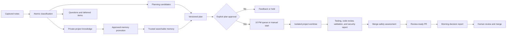

# Continuity Suite

This suite turns project conversations and notes into searchable knowledge, reviewable goals, safely sequenced execution, and evidence-backed reports.

For the detailed human and agent operating sequence across projects, campaigns, and objectives, read [Operating Workflow](docs/operating-workflow.md).

## Operating boundary

Notes are knowledge first. Capture and triage never authorize documentation or code changes. An executable goal requires a decision-complete plan, exact version approval, a valid plan hash, successful preflight, and explicit dispatch.

Every installed skill applies the versioned development assurance standard. The CLI requires the same version in project configuration, enrollment manifests, dispatch records, and compliance ledgers, and blocks incompatible execution or completion.

## Installed layout

```text
.agents/skills/                         project-level skills
.agents/skills/continuity-local/ generated project-specific behavior skill
.agents/continuity/             CLI, schemas, templates, contract
.agents/references/continuity-contract.md
.agents/references/development-assurance-standard.md
.agents/references/testing-and-merge-standard.md
.continuity/project.json                committed enrollment and schedule intent
.continuity/config.json                 committed project configuration
.continuity/project-behavior.json        committed recommendations, overrides, and hash
.continuity/scheduler.json               selected scheduler handoff and registration state
.continuity/private/                    ignored captures, queues, goals, locks, indexes
.continuity-portfolio/                  ignored supervisor claims and capacity reservations
docs/project-memory/                    canonical searchable project memory
docs/project-roadmap/                   canonical sanitized project roadmap
.continuity/shared-notes/packets/       reviewed non-authorizing note packets
```

The installed control directory also includes a provider-neutral portfolio supervisor prompt and adapter contract. One recurring Codex, Claude Code, or external supervisor polls at the configured interval, refreshes an expiring registration heartbeat, calculates per-project due actions from each timezone and schedule, atomically reserves portfolio capacity, and starts isolated project tasks with one-time claims. Active runs plus unconsumed reservations count against the smallest participating project cap. Schedule intent and policy are committed; registration receipts, workspace roots, task IDs, heartbeats, claims, run ledgers, credentials, notes, memory, and recovery state remain private and developer-local.

See `automation/provider-adapter-contract.md` for the provider conformance requirements and proof checklist.

Installation creates a minimal project-memory index, installs `$continuity` as the guided entry point, generates `$continuity-local`, and leaves product-code execution disabled unless `--enable-execution` is explicitly supplied. An optional `--seed` may point to project-specific memory data outside this distribution.

## Installation

```text
python3 continuity-suite/installer/install.py \
  --project-root <repository> \
  --project-id <stable-project-id> \
  --integration-branch <branch> \
  --validation <project-validation-command>
```

The main skill guides the user through recommended defaults and explicit overrides. For a deterministic initial install, pass `--configuration <answers.json>`; for a terminal questionnaire, pass `--interactive`. After installation, use:

```text
.agents/continuity/bin/continuity --project-root <repository> --json project recommendations
.agents/continuity/bin/continuity --project-root <repository> project configure --interactive --actor <identity>
.agents/continuity/bin/continuity --project-root <repository> --json project configure --answers-file <answers.json> --actor <identity>
```

Customizable settings cover the integration branch, timezone, three schedules, runtime, memory age, validation and security commands, documentation map, visual-evidence mode, branch prefix, reviewed project-specific instructions, agent surfaces, scheduler provider, business days, sweep/retry/stale timing, portfolio concurrency, and execution enrollment. Authorization, security review, merge safety, one code-changing goal per project, next-business-day human review, restricted side effects, no force-push, and no auto-merge remain fixed.

Planning-pattern settings also control evidence triage, decision mapping, dependency-aware delivery slicing, and the preferred tracker provider. Each pattern defaults to `auto`; `local` is the default tracker. Pattern artifacts are project-local, schema-validated, rendered into the human plan, and bound into its approval hash. External tracker publication remains a separate explicit-human-approval action.

Roadmap settings default to full hybrid planning. Canonical Markdown remains committed under `docs/project-roadmap/`; the CLI derives ignored SQLite and JSON projections that can combine roadmap truth with developer-local goals and note links. `continuity roadmap serve --open` launches a read-only loopback companion with timeline, hierarchy, release, milestone, sprint, board, dependency, risk, blocker, and detail views. The companion lives under `.agents/continuity/` and is forbidden from product routes, build inputs, previews, staging, and production packages.

Raw captures never travel through Git. `$continuity-share` lets a developer select atomic notes, review a sanitized hash-bound packet, approve its exact version and current-project target, then publish it through an isolated `continuity-notes/...` branch and human-reviewed PR. Merged packets live under `.continuity/shared-notes/packets/`; other developers explicitly import and triage them. Neither a packet nor its merge authorizes execution or canonical changes.

## Roadmap and note transport commands

```text
continuity roadmap index
continuity roadmap list
continuity roadmap show <roadmap-id>
continuity roadmap brief "<topic-or-id>"
continuity roadmap audit
continuity roadmap link-note <note-id> --to <roadmap-id> --relation <relation>
continuity roadmap create --entry-file <path> --goal-id <approved-goal>
continuity roadmap revise <roadmap-id> --entry-file <path> --goal-id <approved-goal>
continuity roadmap export --scope committed
continuity roadmap serve --open
continuity roadmap production-audit --artifact <build-or-package>

continuity note share prepare <note-id>... --target-project <current-project> --sender <identity>
continuity note share approve <packet-id> --version <version> --approved-by <identity> --authorization-text <text>
continuity note share publish <packet-id>
continuity note share import
continuity note queue --queue <knowledge|questions|documentation|backlog|planning>
continuity note resolve <capture-id> <item-id> --resolution <text> --actor <human>
continuity note patterns --min-count 2
continuity note pattern-review <pattern-id> --disposition <accepted|deferred|dismissed> --actor <human> --evidence <text> [--review-after <iso-date-time>]
continuity note migrate-links --actor <human>
continuity memory similar "<situation>" --scope all

continuity workflow status [--goal-id <goal-id>]

continuity test plan [goal-id]
continuity test run <goal-id> --worktree <path> --branch <branch>
continuity test record <goal-id> --status <passed|failed> --summary <text> --update-gates

continuity merge assess <goal-id> --branch <branch> --pr-url <url> --update-gate
continuity merge record-human <goal-id> --pr-url <url> --merged-by <identity> --disposition <approved|changes-requested|merged|closed> --evidence <text>
```

Run the installer again to update an existing installation; it preserves project behavior and the managed `AGENTS.md` and `.gitignore` blocks remain idempotent. Configuration is hash-bound to the generated project-local skill and selected surface adapters, and `project doctor` fails on drift. Keep developer workspace roots and scheduler registration records in developer-local configuration, never in this repository.

## Typical cycle

The steps below are the concise reference. [Operating Workflow](docs/operating-workflow.md) explains authority, scheduler activation, commands, failure handling, rework, and morning review in detail.

1. Invoke `$continuity` for setup or routing and apply `$continuity-local` with the selected task skill.
2. Invoke `$continuity-capture` in the active project conversation.
3. Invoke `$continuity-triage`, or allow the nightly review to classify and route items. Refine occurrence dimensions and review recurring patterns when useful.
4. Use `$continuity-memory` and `$continuity-roadmap` to retrieve cited context briefs. Private similarity may inform triage, but only canonical promoted memory is trusted planning evidence. Use the local read-only roadmap sidecar when visual transport helps.
5. Use `$continuity-share` only for explicitly selected, sanitized, approved developer handoffs.
6. Use `$continuity-plan` only for selected candidates. Verify action claims, map unresolved decisions for complex work, record `roadmap_ids` and structured `roadmap_impact`, and slice multi-part outcomes into an acyclic end-to-end delivery graph when applicable.
7. Approve an exact goal version; it queues for the project-configured dispatch time.
8. Use `$continuity-dispatch` to start an approved goal earlier when needed.
9. Use `$continuity-execute` in the assigned isolated worktree. Complete implementation, candidate checks, documentation, memory, roadmap, and evidence artifacts, then commit them.
10. Use `$continuity-test` for the final source-bound run on that committed state, then push the tested commit and create or update the draft PR.
11. Use `$continuity-merge` to bind merge safety to the local head, remote head, PR head, and configured base, then record the later human disposition.
12. End overnight work at `review-ready`; use `$continuity-report` for a decision-first morning report.
13. Record human review separately as `approved`, `changes-requested`, `merged`, or `closed`. In-scope changes reopen the same goal with explicit authorization; scope changes require revision and fresh approval. Only recorded merge evidence moves the goal to `completed`.



## Responsible development compliance

Every goal has a `compliance.json` ledger. The CLI blocks approval until memory retrieval, roadmap retrieval, and plan review are evidenced, blocks dispatch on failed preflight, and blocks `review-ready` until implementation, code review, validation, security review, merge safety, documentation, memory impact, roadmap impact, and final alignment are passed or explicitly not applicable with evidence. A passing validation record requires machine-run evidence that still matches the current source fingerprint, approved plan hash, behavior hash, and configured commands. `$continuity-test` and `$continuity-merge` make these gates explicit. Only recorded human merge evidence moves the goal to `completed`.

The planning patterns were adapted from lessons in Matt Pocock's MIT-licensed `triage`, `wayfinder`, and `to-tickets` skills. See `references/planning-patterns.md` for the reviewed upstream commit, provenance, and continuity-specific safety changes. The upstream skills are not bundled or invoked.

## Local validation

```text
python3 -m unittest discover -s continuity-suite/tests -v
python3 -m py_compile continuity-suite/bin/continuity continuity-suite/lib/*.py continuity-suite/installer/install.py
```

Validate each skill with the `skill-creator` `quick_validate.py` utility. The validator requires PyYAML in its Python environment.

## Future adapters

The capture schema reserves `notion` and `linear` source types. An adapter must provide stable source references, timestamps, deduplication keys, provenance, and raw snapshot references. It must enter through the same classification and authorization gates; integrations may not dispatch work directly.
