# Continuity Suite

This suite turns project conversations and notes into searchable knowledge, reviewable goals, safely sequenced execution, and evidence-backed reports.

For a first local install path, read [Quickstart](docs/quickstart.md). For the detailed human and agent operating sequence across projects, campaigns, and objectives, read [Operating Workflow](docs/operating-workflow.md).

## Operating boundary

Notes are knowledge first. Capture and triage never authorize documentation or code changes. For routine interactive work, `/goal` binds the exact user request to a decision-complete plan hash and records approval plus dispatch atomically. Unattended, elevated-risk, consequential, and separately prepared work retains distinct approval and dispatch decisions.

Every installed skill applies the versioned development assurance standard. The CLI requires the same version in project configuration, enrollment manifests, dispatch records, and compliance ledgers, and blocks incompatible execution or completion.

## Installed layout

```text
.agents/skills/                         project-level skills
.agents/skills/continuity-local/ generated project-specific behavior skill
.agents/continuity/             CLI, schemas, templates, contract
.agents/references/continuity-contract.md
.agents/references/development-assurance-standard.md
.agents/references/testing-and-merge-standard.md
.claude/commands/continuity-*.md Claude Code slash-command shims
.cursor/commands/continuity-*.md Cursor slash-command shims
.continuity/project.json                committed enrollment and schedule intent
.continuity/config.json                 committed project configuration
.continuity/project-behavior.json        committed recommendations, overrides, and hash
.continuity/scheduler.json               selected scheduler handoff and registration state
.continuity/private/                    ignored captures, queues, goals, locks, indexes
.continuity/private/source-snapshots/   ignored exact PRD and feature-request revisions
.continuity/private/skill-improvement/ ignored usage, proposals, evaluations, and review evidence
.continuity-portfolio/                  ignored supervisor claims and capacity reservations
docs/project-memory/                    canonical searchable project memory
docs/project-roadmap/                   canonical sanitized project roadmap
docs/design/design.md                   exact approved design direction when the optional collection is enabled
.continuity/design.json                 approved design ID, revision, hash, catalog versions, and non-authorizing state
.continuity/shared-notes/packets/       reviewed non-authorizing note packets
```

The installed control directory also includes a provider-neutral portfolio supervisor prompt and adapter contract. One recurring Codex, Claude Code, or external supervisor polls at the configured interval, refreshes an expiring registration heartbeat, calculates per-project due actions from each timezone and schedule, atomically reserves portfolio capacity, and starts isolated project tasks with one-time claims. Active runs plus unconsumed reservations count against the smallest participating project cap. Schedule intent and policy are committed; registration receipts, workspace roots, task IDs, heartbeats, claims, run ledgers, credentials, notes, memory, and recovery state remain private and developer-local.

See `automation/provider-adapter-contract.md` for the provider conformance requirements and proof checklist.

Installation creates a minimal project-memory index, installs `/goal` as the primary action entry point, keeps `$continuity` for configuration and routing, installs `$continuity-workflow` for resumed and scheduled work, generates `$continuity-local`, and leaves product-code execution disabled unless `--enable-execution` is explicitly supplied. An optional `--seed` may point to project-specific memory data outside this distribution.

## Installation

For the copy-paste install, local configuration, and slash-command sequence, start with [Quickstart](docs/quickstart.md).

```text
python3 continuity-suite/installer/install.py \
  --project-root <repository> \
  --project-id <stable-project-id> \
  --integration-branch <branch> \
  --validation <project-validation-command>
```

Add `--collection design` for projects that need the optional offline design workflow. Core and project-management collections remain enabled by default; upgrades preserve the project’s selected collections.

The main skill guides the user through recommended defaults and explicit overrides. For a deterministic initial install, pass `--configuration <answers.json>`; for a terminal questionnaire, pass `--interactive`. After installation, use:

```text
.agents/continuity/bin/continuity --project-root <repository> --json project recommendations
.agents/continuity/bin/continuity --project-root <repository> project configure --interactive --actor <identity>
.agents/continuity/bin/continuity --project-root <repository> --json project configure --answers-file <answers.json> --actor <identity>
```

Customizable settings cover the integration branch, timezone, three schedules, runtime, memory age, product-audit refresh age, validation and security commands, GitHub checks and reviewer threshold, opt-in exact human-authorized GitHub CLI merge, documentation map, visual-evidence mode, branch prefix, reviewed project-specific instructions, agent surfaces, scheduler provider, business days, sweep/retry/stale timing, portfolio concurrency, and execution enrollment. Authorization, security review, product-conformance gating, merge safety, one code-changing goal per project, human merge authority, restricted side effects, no administrator bypass, no force-push, and no auto-merge remain fixed.

Planning-pattern settings also control evidence triage, decision mapping, dependency-aware delivery slicing, and the preferred tracker provider. Each pattern defaults to `auto`; `local` is the default tracker. Pattern artifacts are project-local, schema-validated, rendered into the human plan, and bound into its approval hash. External tracker publication remains a separate explicit-human-approval action.

Roadmap settings default to full hybrid planning. Canonical Markdown remains committed under `docs/project-roadmap/`; the CLI derives ignored SQLite and JSON projections that can combine roadmap truth with developer-local goals and note links. `continuity roadmap serve --open` launches a read-only loopback companion with timeline, hierarchy, release, milestone, sprint, board, dependency, risk, blocker, and detail views. The companion lives under `.agents/continuity/` and is forbidden from product routes, build inputs, previews, staging, and production packages.

When `tracker_provider` is explicitly configured as `github`, `continuity roadmap github-projects` can approval-bootstrap a Project through GitHub CLI and prepare, inspect, approve, and apply an export-only projection. Bootstrap plans bind the owner, title, visibility, settings destination, and complete field contract; export plans bind the exact Project, selected canonical entries, field mappings, and source revisions. Each remote-write phase requires exact human approval. GitHub edits remain non-authorizing reconciliation proposals, and the adapter does not create repository issues or mutate canonical roadmap files from remote state.

Raw captures never travel through Git. `$continuity-share` lets a developer select atomic notes, review a sanitized hash-bound packet, approve its exact version and current-project target, then publish it through an isolated `continuity-notes/...` branch and human-reviewed PR. Merged packets live under `.continuity/shared-notes/packets/`; other developers explicitly import and triage them. Neither a packet nor its merge authorizes execution or canonical changes.

## Roadmap and note transport commands

```text
continuity roadmap index
continuity roadmap inbox
continuity roadmap list
continuity roadmap show <roadmap-id>
continuity roadmap brief "<topic-or-id>"
continuity roadmap audit
continuity roadmap link-note <note-id> --to <roadmap-id> --relation <relation>
continuity roadmap create --entry-file <path> --goal-id <approved-goal>
continuity roadmap revise <roadmap-id> --entry-file <path> --goal-id <approved-goal>
continuity roadmap export --scope committed
continuity roadmap serve --open
continuity roadmap github-projects bootstrap plan --owner-type organization --owner <owner> --title <title>
continuity roadmap github-projects bootstrap approve <plan-hash> --approved-by <identity> --authorization-text <exact-text>
continuity roadmap github-projects bootstrap apply <plan-hash>
continuity roadmap github-projects plan --settings .continuity/github-projects.json
continuity roadmap github-projects inspect <plan-hash>
continuity roadmap github-projects approve <plan-hash> --approved-by <identity> --authorization-text <exact-text>
continuity roadmap github-projects apply <plan-hash>
continuity roadmap production-audit --artifact <build-or-package>

continuity note share prepare <note-id>... --target-project <current-project> --sender <identity>
continuity note share approve <packet-id> --version <version> --approved-by <identity> --authorization-text <text> [--signing-key <ssh-private-key>]
continuity note share publish <packet-id>
continuity note share import
continuity note queue --queue <knowledge|questions|documentation|backlog|planning>
continuity note resolve <capture-id> <item-id> --resolution <text> --actor <human>
continuity note related-goals <note-id> [--limit 5] [--min-score 0.08]
continuity note relate <note-id> --goal-id <goal-id> --disposition <later|context-only|duplicate> --reason <reason> [--review-after <iso-date-time> | --roadmap-id <roadmap-id>] --actor <human>
continuity note patterns --min-count 2
continuity note pattern-review <pattern-id> --disposition <accepted|deferred|dismissed> --actor <human> --evidence <text> [--review-after <iso-date-time>]
continuity note migrate-links --actor <human>
continuity note migrate-lifecycle --actor <human>
continuity memory similar "<situation>" --scope all

continuity workflow status [--capture-id <id> | --note-id <id> | --memory-id <id> | --roadmap-id <id> | --packet-id <id> | --audit-id <id> | --goal-id <id>]

continuity design catalog
continuity design draft --input <design-input.json>
continuity design select <design-id> --direction <direction-id> [--combine <direction-id>] --actor <identity>
continuity design approve <design-id> --revision <revision> --approved-by <identity> --authorization-text <exact-text>
continuity workflow status --design-id <design-id>

continuity portfolio update --root <workspace>
continuity portfolio update --root <workspace> --apply
continuity portfolio update --root <workspace> --version <tag> --apply

continuity test plan [goal-id]
continuity test run <goal-id> --worktree <path> --branch <branch>
continuity test record <goal-id> --status <passed|failed> --summary <text> --update-gates

continuity audit plan --input <audit-input.json> [--goal-id <goal-id>]
continuity audit start <audit-id> --worktree <path> --branch <branch>
continuity audit record <audit-id> --result-file <result.json> --artifact <product-conformance.md> --update-gate
continuity audit capture-findings <audit-id>
continuity audit compare <audit-id> --against <prior-audit-id>
continuity audit due

continuity improve baseline <skill-name>
continuity improve usage-record --input <usage.json>
continuity improve patterns <skill-name> --min-count 2
continuity improve propose --input <proposal.json> --candidate <candidate-learned-playbook.md>
continuity improve evaluate <proposal-id> --result-file <evaluation.json>
continuity improve review <proposal-id> --disposition <approved|rejected|held> --actor <human> --authorization-text <text> --evidence <text>
continuity improve show [proposal-id]
continuity improve package <proposal-id> --output <project-relative-directory>

continuity merge assess <goal-id> --branch <branch> --pr-url <url> --update-gate
continuity merge record-human <goal-id> --pr-url <url> --merged-by <identity> --disposition <approved|changes-requested|merged|closed> --evidence <text>
```

The offline design catalog selects one foundation pack per active axis plus any reviewed category overlays matching the design input. Draft and approved design records preserve every selected pack ID and version.

Use `continuity suite update --check`, a dry run, and an explicit tagged update for existing installations. Release artifacts are attested and hash-manifested; modified suite-managed files fail closed, each update creates a rollback snapshot, and project-owned configuration and ignored private state remain outside release replacement. See [Releases, Updates, and Recovery](docs/releases-updates-and-recovery.md). Configuration is hash-bound to the generated project-local skill and selected surface adapters, and `project doctor` fails on drift. Keep developer workspace roots and scheduler registration records in developer-local configuration, never in this repository.

`continuity portfolio update` applies that same project-local transaction across discovered projects. It is a dry-run unless `--apply` is present, runs doctor before and after each project, isolates unhealthy projects, and restores the project snapshot automatically when post-update doctor fails.

## Typical cycle

The steps below are the concise reference. [Operating Workflow](docs/operating-workflow.md) explains authority, scheduler activation, commands, failure handling, rework, and morning review in detail.

1. Invoke `/goal <request>` for routine interactive implementation. It applies `$continuity-local`, captures and triages the request, updates the private roadmap inbox, creates the smallest aligned goal, activates it, and continues into code without routine handoff pauses. Use `$continuity` for setup or routing and `$continuity-workflow` for resumed, scheduled, diagnostic, or separately reviewed work.
2. For knowledge-only intake, invoke `$continuity-capture` in the active project conversation or point it to a local Markdown/plain-text PRD or feature request. One document revision remains one source capture with multiple atomic items.
3. Invoke `$continuity-triage`, or allow `/goal` or the nightly review to classify and route items. Actionable triaged notes appear immediately in the private roadmap inbox.
4. Use `$continuity-memory` and `$continuity-roadmap` to retrieve cited context briefs. Private similarity may inform triage, but only canonical promoted memory is trusted planning evidence. Use the local read-only roadmap sidecar when visual transport helps.
5. Use `$continuity-share` only for explicitly selected, sanitized, approved developer handoffs.
6. When material experience decisions are unresolved and the optional collection is enabled, use `$continuity-design` to select and exactly approve `docs/design/design.md`. This approves only the design document.
7. Use `$continuity-plan` only for selected candidates. Verify action claims, map unresolved decisions for complex work, record `roadmap_ids`, `design_ids` when applicable, and structured `roadmap_impact`, and slice multi-part outcomes into an acyclic end-to-end delivery graph when applicable.
8. For routine `/goal` work, bind the exact request and activate the aligned plan immediately. For unattended, elevated-risk, consequential, signed-policy, or separately prepared work, approve an exact goal version and use `$continuity-dispatch`.
9. Continue directly into execution when fast activation succeeds.
10. Use `$continuity-execute` in the assigned isolated worktree. Complete implementation, candidate checks, documentation, memory, roadmap, and evidence artifacts, then commit them.
11. Use `$continuity-test` for the final source-bound run on that committed state.
12. Use `$continuity-product-audit` to reconcile applicable product behavior with approved intent, including any exact approved design, on the same source state, or record explicit not-applicable evidence.
13. Push the tested and audited commit, then use `$continuity-merge` to bind merge safety to the local head, remote head, PR head, and configured base.
14. End overnight work at `review-ready`; use `$continuity-report` for a decision-first morning report.
15. Record human review separately as `approved`, `changes-requested`, `merged`, or `closed`. In-scope changes reopen the same goal with explicit authorization; scope changes require revision and fresh approval. Only recorded merge evidence moves the goal to `completed`.
16. When a skill outcome has sanitized objective evidence, use `$continuity-improve` to record usage and periodically evaluate recurring patterns. An accepted and human-reviewed learned-playbook package remains non-authorizing until a separate approved suite-source goal applies and releases it.

```mermaid
flowchart LR
    Z["/goal request"] --> A["Capture and atomic triage"]
    A --> E["Private roadmap inbox"]
    B --> C["Private project knowledge"]
    B --> D["Questions and deferred items"]
    A --> B["Knowledge and questions"]
    C --> F["Approved memory promotion"]
    F --> G["Trusted searchable memory"]
    E --> H["Smallest aligned plan"]
    G --> H
    H --> I{"Authority path"}
    I -->|"Routine interactive"| K["Request-bound activation"]
    I -->|"Unattended or higher risk"| J["Separate approval and dispatch"]
    J --> K
    K --> L["Isolated project worktree"]
    L --> M["Testing, code review, validation, and security report"]
    M --> N["Product-conformance audit"]
    N --> O["Merge-safety assessment"]
    O --> R["Review-ready PR"]
    R --> P["Morning decision report"]
    P --> Q["Human review and merge"]
```



## Responsible development compliance

Every goal has a `compliance.json` ledger. The CLI blocks approval until memory retrieval, roadmap retrieval, and plan review are evidenced, blocks dispatch on failed preflight, and blocks `review-ready` until implementation, code review, validation, security review, product conformance, merge safety, documentation, memory impact, roadmap impact, and final alignment are passed or explicitly not applicable with evidence. A passing validation or product-audit record requires source-bound evidence that still matches the current source fingerprint, approved plan hash, behavior hash, and configured commands. `$continuity-test`, `$continuity-product-audit`, and `$continuity-merge` make these gates explicit. Only recorded human merge evidence moves the goal to `completed`; an opted-in direct CLI merge still requires an exact interactive human authorization and GitHub verification.

The planning patterns were adapted from lessons in Matt Pocock's MIT-licensed `triage`, `wayfinder`, and `to-tickets` skills. See `references/planning-patterns.md` for the reviewed upstream commit, provenance, and continuity-specific safety changes. The upstream skills are not bundled or invoked.

## Local validation

```text
python3 -m unittest discover -s continuity-suite/tests -v
python3 -m py_compile continuity-suite/bin/continuity continuity-suite/lib/*.py continuity-suite/installer/install.py
```

Validate each skill with the `skill-creator` `quick_validate.py` utility. The validator requires PyYAML in its Python environment.

## Future adapters

Document capture v1 accepts local UTF-8 Markdown and plain-text files. `source_type` records transport while `document_type` records `prd` or `feature-request`. Exact snapshots remain private; unchanged hashes deduplicate, changed hashes create linked revisions, and goals derived from document items bind the originating capture and source hash into the plan approval hash. The capture schema reserves `notion` and `linear` source types. An adapter must provide stable source references, timestamps, hashes, provenance, and raw snapshot references, and it must enter through the same classification and authorization gates without dispatching work directly.
