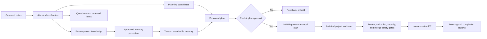

# Project Continuity Suite

This suite turns project conversations and notes into searchable knowledge, reviewable goals, safely sequenced execution, and evidence-backed reports.

## Operating boundary

Notes are knowledge first. Capture and triage never authorize documentation or code changes. An executable goal requires a decision-complete plan, exact version approval, a valid plan hash, successful preflight, and explicit dispatch.

## Installed layout

```text
.agents/skills/                         project-level skills
.agents/project-continuity/             CLI, schemas, templates, contract
.agents/references/continuity-contract.md
.continuity/config.json                 committed project configuration
.continuity/private/                    ignored captures, queues, goals, locks, indexes
docs/project-memory/                    canonical searchable project memory
```

The installed control directory also includes the recurring-action prompt assets and portfolio registry snapshot. The Codex app owns the actual 8:00 PM review, 10:00 PM dispatch, and 7:00 AM reporting schedules.

## Typical cycle

1. Invoke `$capture-project-note` in the active project conversation.
2. Invoke `$triage-project-notes`, or allow the nightly review to classify and route items.
3. Use `$manage-project-memory` to retrieve a cited context brief.
4. Use `$plan-project-goals` only for selected candidates.
5. Approve an exact goal version; it queues for 10:00 PM America/Chicago.
6. Use `$dispatch-project-goals` to start an approved goal earlier when needed.
7. Use `$execute-project-goal` in the assigned isolated worktree.
8. Use `$report-project-progress` for completion and morning reporting.



## Responsible development compliance

Every goal has a `compliance.json` ledger. The CLI blocks approval until memory retrieval and plan review are evidenced, blocks dispatch on failed preflight, and blocks completion until implementation, code review, validation, security review, merge safety, documentation, memory impact, and final alignment are passed or explicitly not applicable with evidence.

## Local validation

```text
python3 -m unittest discover -s project-continuity-suite/tests -v
python3 -m py_compile project-continuity-suite/bin/continuity project-continuity-suite/installer/install.py
```

Validate each skill with the `skill-creator` `quick_validate.py` utility. The validator requires PyYAML in its Python environment.

## Future adapters

The capture schema reserves `notion` and `linear` source types. An adapter must provide stable source references, timestamps, deduplication keys, provenance, and raw snapshot references. It must enter through the same classification and authorization gates; integrations may not dispatch work directly.
