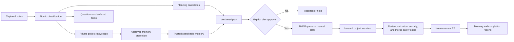

# Project Continuity Suite

This suite turns project conversations and notes into searchable knowledge, reviewable goals, safely sequenced execution, and evidence-backed reports.

## Operating boundary

Notes are knowledge first. Capture and triage never authorize documentation or code changes. An executable goal requires a decision-complete plan, exact version approval, a valid plan hash, successful preflight, and explicit dispatch.

Every installed skill applies the versioned development assurance standard. The CLI requires the same version in project configuration, enrollment manifests, dispatch records, and compliance ledgers, and blocks incompatible execution or completion.

## Installed layout

```text
.agents/skills/                         project-level skills
.agents/skills/project-continuity-local/ generated project-specific behavior skill
.agents/project-continuity/             CLI, schemas, templates, contract
.agents/references/continuity-contract.md
.continuity/project.json                committed enrollment and schedule intent
.continuity/config.json                 committed project configuration
.continuity/project-behavior.json        committed recommendations, overrides, and hash
.continuity/private/                    ignored captures, queues, goals, locks, indexes
docs/project-memory/                    canonical searchable project memory
```

The installed control directory also includes project-neutral recurring-action prompt assets. The Codex app owns each developer's actual schedules. A developer-local scheduler discovers enrolled repositories from configured workspace roots, then invokes the skills and CLI installed inside each project. No project paths, notes, memory, or registry are stored in this distribution.

Installation creates a minimal project-memory index, installs `$project-continuity` as the guided entry point, generates `$project-continuity-local`, and leaves product-code execution disabled unless `--enable-execution` is explicitly supplied. An optional `--seed` may point to project-specific memory data outside this distribution.

## Installation

```text
python3 project-continuity-suite/installer/install.py \
  --project-root <repository> \
  --project-id <stable-project-id> \
  --integration-branch <branch> \
  --validation <project-validation-command>
```

The main skill guides the user through recommended defaults and explicit overrides. For a deterministic initial install, pass `--configuration <answers.json>`; for a terminal questionnaire, pass `--interactive`. After installation, use:

```text
.agents/project-continuity/bin/continuity --project-root <repository> --json project recommendations
.agents/project-continuity/bin/continuity --project-root <repository> project configure --interactive --actor <identity>
.agents/project-continuity/bin/continuity --project-root <repository> --json project configure --answers-file <answers.json> --actor <identity>
```

Customizable settings cover the integration branch, timezone, three schedules, runtime, memory age, validation and security commands, documentation map, visual-evidence mode, branch prefix, reviewed project-specific instructions, and execution enrollment. Authorization, security review, merge safety, one code-changing goal per project, human merge, no force-push, and no auto-merge remain fixed.

Planning-pattern settings also control evidence triage, decision mapping, dependency-aware delivery slicing, and the preferred tracker provider. Each pattern defaults to `auto`; `local` is the default tracker. Pattern artifacts are project-local, schema-validated, rendered into the human plan, and bound into its approval hash. External tracker publication remains a separate explicit-human-approval action.

Run the installer again to update an existing installation; it preserves project behavior and the managed `AGENTS.md` and `.gitignore` blocks remain idempotent. Configuration is hash-bound to the generated project-local skill, and `project doctor` fails on drift. Keep developer workspace roots and Codex automation records in developer-local configuration, never in this repository.

## Typical cycle

1. Invoke `$project-continuity` for setup or routing and apply `$project-continuity-local` with the selected task skill.
2. Invoke `$capture-project-note` in the active project conversation.
3. Invoke `$triage-project-notes`, or allow the nightly review to classify and route items.
4. Use `$manage-project-memory` to retrieve a cited context brief.
5. Use `$plan-project-goals` only for selected candidates. Verify action claims, map unresolved decisions for complex work, and slice multi-part outcomes into an acyclic end-to-end delivery graph when applicable.
6. Approve an exact goal version; it queues for the project-configured dispatch time.
7. Use `$dispatch-project-goals` to start an approved goal earlier when needed.
8. Use `$execute-project-goal` in the assigned isolated worktree.
9. Use `$report-project-progress` for completion and morning reporting.



## Responsible development compliance

Every goal has a `compliance.json` ledger. The CLI blocks approval until memory retrieval and plan review are evidenced, blocks dispatch on failed preflight, and blocks completion until implementation, code review, validation, security review, merge safety, documentation, memory impact, and final alignment are passed or explicitly not applicable with evidence.

The planning patterns were adapted from lessons in Matt Pocock's MIT-licensed `triage`, `wayfinder`, and `to-tickets` skills. See `references/planning-patterns.md` for the reviewed upstream commit, provenance, and continuity-specific safety changes. The upstream skills are not bundled or invoked.

## Local validation

```text
python3 -m unittest discover -s project-continuity-suite/tests -v
python3 -m py_compile project-continuity-suite/bin/continuity project-continuity-suite/installer/install.py
```

Validate each skill with the `skill-creator` `quick_validate.py` utility. The validator requires PyYAML in its Python environment.

## Future adapters

The capture schema reserves `notion` and `linear` source types. An adapter must provide stable source references, timestamps, deduplication keys, provenance, and raw snapshot references. It must enter through the same classification and authorization gates; integrations may not dispatch work directly.
